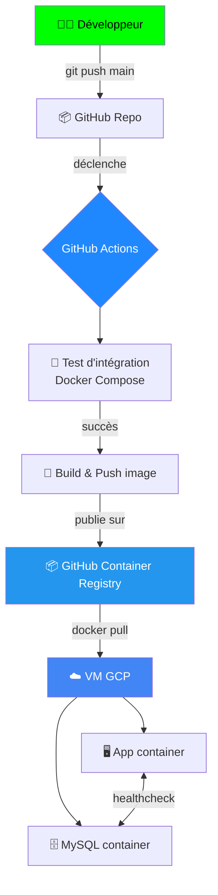

<div align="center">

# ⚙️ Pipeline CI/CD & Infrastructure as Code sur GCP

### Déploiement automatisé d'une application conteneurisée en production


</div>

---

## 📖 Vue d'ensemble

Application todo-list (Node.js + MySQL) déployée en production sur **Google Cloud Platform**, avec un pipeline CI/CD complet piloté par **GitHub Actions** et une infrastructure entièrement provisionnée en code avec **Terraform**.

## 🏗️ Architecture



## 🛠️ Stack technique

| Brique | Outil |
|---|---|
| 🖥️ Application |    |
| 📦 Conteneurisation |   |
| 🔄 CI/CD |  |
| 📥 Registre d'images |  |
| 🏗️ Infrastructure as Code |  |
| ☁️ Cloud |  |

---

## 🔄 Pipeline CI/CD

Déclenché à chaque `push` ou `pull_request` vers `main` (`.github/workflows/ci.yml`) :


- **`integration-test`** — démarre l'application avec Docker Compose, attend qu'elle réponde via une boucle de retry sur `curl`, affiche les logs en cas d'échec, nettoie toujours les conteneurs.
- **`build-and-push`** — (uniquement sur `push` vers `main`) construit l'image Docker et la publie sur `ghcr.io`.

---

## 🏗️ Infrastructure (Terraform)

Dossier `infra/` :

- 🖥️ `google_compute_instance` — VM Debian 12 hébergeant l'application
- 🔥 `google_compute_firewall` — ouverture du port applicatif
- 📤 `outputs.tf` — expose l'IP externe de la VM après provisionnement

```bash
cd infra
terraform init
terraform plan
terraform apply
```

---

## 🚀 Déploiement sur la VM

Sur la VM, un `compose.yaml` de production utilise directement l'image publiée sur `ghcr.io` (pas de build local) et inclut un **healthcheck MySQL** pour garantir que l'application ne démarre qu'une fois la base de données réellement prête :

```bash
docker compose pull
docker compose up -d
```

---

## 💡 Points techniques notables

> 🔐 **SSH via port 443** — contournement d'un blocage réseau du port 22 en configurant SSH pour transiter par `ssh.github.com:443`.

> 🩺 **Healthcheck MySQL** — résolution d'une race condition où l'application tentait de se connecter à MySQL avant que celui-ci soit prêt à accepter des connexions.

> 🔑 **Gestion des secrets** — authentification au registre via `GITHUB_TOKEN` généré automatiquement, sans identifiants en dur dans le pipeline.

---

<div align="center">

**Fait par [Younes Taibi](https://github.com/taibi1995)** · [Portfolio](https://taibi1995.github.io/portfolio)

</div>
